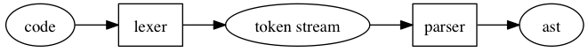

# Build your own programming language

## Prerequisites

- You have Docker installed (if not please check https://docs.docker.com/get-docker/)

## Introduction

In this assignment you'll learn about how to create a programming language using OOP techniques and write an interpreter to evaluate any program.

## The language

A symbolic expression is a notation of a nested list structure. It's origin lies within the Lisp family of programming languages whose entire syntax consists of these expressions.

An s-expression is either an atom or an ordered pair of s-expressions. In practice that just means that you have lists of s-expressions that can be nested.

An atom is a symbol which is essentially a value that is not a list. Here are a few examples of atoms:

- `foo`
- `an-atom`
- `42`

Lists are represented by parentheses. They can be empty, or hold atoms, delimited by spaces.

 - `()`
 - `(foo)`
 - `(foo bar)`
 - `(foo bar baz)`

Lists can also contain other lists, allowing them to be nested:

 - `((foo) (bar))`
 - `((a 1) (b 2))`
 - `(alpha (beta (gamma (delta))))`
 
This should give you a basic understanding of how the s-expression syntax works.

What's really fascinating about s-expressions is that they can be used to represent not only data, but also code.

Here is one of the most basic Lisp code snippets:

```
(+ 1 2)
```

It looks cryptic, but it's actually quite simple. Instead of infix notation, this is using Polish notation, also known as prefix notation. What the expression represents is this:

```
1 + 2
```

The parentheses tell you that it's a function application or function invocation. The first element of the list is a function, the remaining elements are the arguments passed to that function. '+' is simply a function which sums up any arguments it receives.

So what about other functions, that are not operators? They work the same way. For example, this application:

```
(foo a b)
```

Would be written like this in PHP:

```
foo($a, $b);
```

## Building a lexer

Parsing a language or a data format is often implemented as a two-step process. The first step is lexing which takes raw data and translates it to a token stream. The second step is parsing which translates a token stream to an abstract syntax tree.



The job of the lexer is tokenization. You give it code, it looks at the characters, groups them and labels those groups with some sort of type.

It usually does not perform any validation on the tokens, except for very basic checks, such as throwing an exception if no valid token is matched at all.

Here is an example of some possible inputs you could feed into an s-expression lexer, and the resulting outputs:

```
+---------------+----------------------------------------------------+
| S-expression  | Tokens                                             |
+---------------+----------------------------------------------------+
| foo           | ["foo"]                                            |
| an-atom       | ["an-atom"]                                        |
| ()            | ["(", ")"]                                         |
| (foo)         | ["(", "foo", ")"]                                  |
| (foo bar)     | ["(", "foo", "bar", ")"]                           |
| (foo bar baz) | ["(", "foo", "bar", "baz", ")"]                    |
| (+ 1 2)       | ["(", "+", "1", "2", ")"]                          |
| ((a 1) (b 2)) | ["(", "(", "a", "1", ")", "(", "b", "2", ")", ")"] |
+---------------+----------------------------------------------------+
```

The lexer will be a class with a single tokenize method.

```
$lexer = new Lexer();
$tokens = $lexer->tokenize($code);
```

### Step 0 - Read PHPUnit docs

Test-driven development is an important technique for writing high quality code. This project uses PHPUnit to write tests. 

Start by reading this section of the [PHPUnit](https://phpunit.readthedocs.io/en/9.5/writing-tests-for-phpunit.html) documentation to get a quick introduction to PHPUnit.  

### Step 1 - Create a test case

Now that you know how to write a test case using PHPUnit, create a TestCase in the `tests` folder. Name the file `LexerTest`.

### Step 2 - Set up the test method

Write a single test method that focuses on testing the `tokenize` method. This method should have two input arguments `string $code` and `array $expectedTokens`.

### Step 3 - Create a data provider

Now we have our first test method, we are going to use a data provider to feed test cases to this method. 

Read this section of the [PHPUnit](https://phpunit.readthedocs.io/en/9.5/writing-tests-for-phpunit.html?highlight=data%20provider#data-providers) documentation about data providers.

### Step 4 - Add your first case to the data provider

Try to think of the simplest case you can test. Hint: this is usually the least amount of data you can possibly feed your test. Add this case to the data provider.

### Step 5 - Run the test

Run the tests. You should see an output like this telling you that it misses the `Lexer` class.

```
➜  vendor/bin/phpunit tests/                     
PHPUnit 9.5.26 by Sebastian Bergmann and contributors.

Runtime:       PHP 8.1.12
Configuration: /phpunit.xml.dist

E                                                                   1 / 1 (100%)

Time: 00:00.003, Memory: 6.00 MB

There was 1 error:

1) App\LexerTest::it_tokenizes with data set #0 ('', array())
   Error: Class "App\Lexer" not found

/LexerTest.php:15

ERRORS!
Tests: 1, Assertions: 0, Errors: 1.
```

### Step 5 - Create the Lexer class

Create a Lexer class containing a `tokenize` method. This method must have a single input argument `string $code` and must have return `array` return type. Leave the method empty.

Run the tests again. You should now get the following output:

```
➜  vendor/bin/phpunit tests/
PHPUnit 9.5.26 by Sebastian Bergmann and contributors.

Runtime:       PHP 8.1.12
Configuration: /phpunit.xml.dist

E                                                                   1 / 1 (100%)

Time: 00:00.003, Memory: 6.00 MB

There was 1 error:

1) App\LexerTest::it_tokenizes with data set #0 ('', array())
TypeError: App\Lexer::tokenize(): Return value must be of type array, none returned

/src/Lexer.php:10
/tests/LexerTest.php:15

ERRORS!
Tests: 1, Assertions: 0, Errors: 1.
```

### Step 6 - Implement the first test case

Implement the simple test case you have defined in step 4. Run the tests again and make sure this time it passes.

```
➜  vendor/bin/phpunit tests/
PHPUnit 9.5.26 by Sebastian Bergmann and contributors.

Runtime:       PHP 8.1.12
Configuration: /phpunit.xml.dist

.                                                                   1 / 1 (100%)

Time: 00:00.002, Memory: 6.00 MB

OK (1 test, 1 assertion)
```

### Step 7 - Add another test

Go back to the TestCase and add another test case to the data provider. Try to think of a case that is slightly more complex than the simplest case you added in step 4. Once you've added the test case run the tests and make sure it's failing. 

> It's important that you verify the test is failing before you start implementing to verify your implementation does not yet support the use case!

Now implement the logic needed to let the second test pass.

### Step 8 - Add as many tests as you can 

Repeat the process of step 7 until you have reached a number of test cases that cover all the possible use cases.

### Building a reader

...to be continued...


